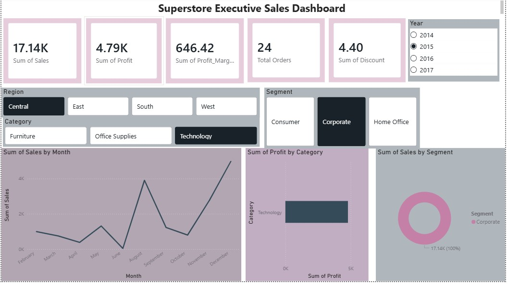

# 🛒 Superstore Sales Data Pipeline & Analytics Dashboard


> A complete end-to-end data engineering and analytics project — from raw retail CSV to executive-level Power BI dashboard — built with Python, SQLite, and Power BI Desktop.

---

## 📌 Project Overview

This project implements a **production-grade data pipeline** that ingests, cleans, validates, and transforms 9,994 retail transactions spanning 4 years (2014–2017) from the Superstore dataset. The processed data is loaded into a SQLite database, queried across multiple business dimensions, and visualized in an interactive Power BI dashboard for executive decision-making.

---

## 🎯 Key Business Insights

| Insight | Finding |
|---|---|
| 📦 Top Category by Profit | **Technology** — contributes **50.79%** of total profit |
| 🌍 Top Region | **West** — $108K profit, highest of all 4 regions |
| 📉 Worst State | **Texas** — ($25,729) loss despite $170K in sales |
| 📈 Peak Quarter | **Q4 2016** — $38,139 profit, best single quarter |
| 🏆 Top Sub-Category | **Copiers** — $55,617 profit on $149K sales |
| ⚠️ Loss Leader | **Tables** (Furniture) — consistent negative margin |

> 💡 **Strategic Recommendation**: Double marketing budget for Technology products in the West region. Consider discontinuing deep discounts on Furniture — Texas alone lost $25K due to aggressive discounting.

---

## 🗂️ Project Structure

```
superstore-pipeline/
│
├── src/
│   ├── config.py          # All paths and constants (single source of truth)
│   ├── ingest.py          # Load raw CSV with logging
│   ├── clean.py           # Clean, validate, assert data quality
│   ├── transform.py       # Derive features, save processed CSV
│   ├── pipeline.py        # Orchestrator — runs full pipeline end-to-end
│   ├── db_load.py         # Load processed data into SQLite
│   └── run_queries.py     # Execute SQL queries, export reports
│
├── data/
│   ├── raw/               # Original untouched CSV (gitignored)
│   └── processed/         # superstore_clean.csv (pipeline output)
│
├── sql/
│   ├── product_analysis.sql   # Category, Sub-Category profit queries
│   ├── region_analysis.sql    # Region, State performance queries
│   └── time_analysis.sql      # Monthly, Quarterly trend queries
│
├── reports/               # CSV exports from SQL queries + dashboard
├── logs/                  # pipeline.log (gitignored)
├── notebooks/             # EDA notebooks
├── requirements.txt
├── .gitignore
└── README.md
```

---

## ⚙️ How to Run

### Prerequisites
- Python 3.10+
- Power BI Desktop (for dashboard)
- Git

### Step 1 — Clone & Setup

```bash
git clone https://github.com/YOUR_USERNAME/superstore-pipeline.git
cd superstore-pipeline

python -m venv venv
venv\Scripts\activate        # Windows
source venv/bin/activate     # Mac/Linux

pip install -r requirements.txt
```

### Step 2 — Add Data

Download the Superstore dataset from Kaggle:
```
https://www.kaggle.com/datasets/vivek468/superstore-dataset-final
```

Place file at:
```
data/raw/superstore.csv
```

### Step 3 — Run Pipeline

```bash
cd src
python pipeline.py
```

Expected output:
```
INFO — PIPELINE STARTED
INFO — Loaded 9994 rows, 21 columns
INFO — Dates fixed
INFO — All validations passed
INFO — Saved to data/processed/superstore_clean.csv
INFO — PIPELINE COMPLETE — 9994 rows processed
```

### Step 4 — Load Database & Run SQL

```bash
python db_load.py
python run_queries.py
```

Results exported to `reports/` as CSV files.

### Step 5 — Open Dashboard

Open Power BI Desktop → Get Data → CSV → select `data/processed/superstore_clean.csv` → open `reports/Sales.pbix`

---

## 📊 Dashboard Preview



**Dashboard Features:**
- 5 KPI Cards: Total Sales, Total Profit, Profit Margin %, Total Orders, Avg Discount
- Interactive slicers: Year (2014–2017), Region, Category, Segment
- Line chart: Monthly sales trend across 4 years
- Bar chart: Profit by Category with drill-down
- Donut chart: Sales distribution by Customer Segment
- Cross-filtering: All visuals interact with all slicers

---

## 🔬 Pipeline Architecture

```
Raw CSV (9,994 rows)
    │
    ▼
ingest.py       → Load with pandas, log shape & columns
    │
    ▼
clean.py        → Fix dtypes, strip whitespace, drop duplicates
                   Assert: rows ≥ 9000, no nulls in key columns
    │
    ▼
transform.py    → Derive: Year, Month, Quarter, Profit_Margin_Pct,
                   Discount_Impact → Save superstore_clean.csv
    │
    ▼
db_load.py      → Load into SQLite (superstore.db), verify count
    │
    ▼
run_queries.py  → Execute 3 SQL files across product/region/time
                   dimensions → Export 6 CSV reports
    │
    ▼
Power BI        → Connect to clean CSV → 5 KPIs, slicers, charts
```

---

## 📈 SQL Analysis Results

### Product Dimension
| Category | Total Sales | Total Profit | Profit % |
|---|---|---|---|
| Technology | $836,154 | $145,455 | 50.79% |
| Office Supplies | $719,047 | $122,491 | 42.77% |
| Furniture | $742,000 | $18,451 | 6.44% |

### Region Dimension
| Region | Total Sales | Total Profit |
|---|---|---|
| West | $725,458 | $108,418 |
| East | $678,781 | $91,522 |
| South | $391,722 | $46,749 |
| Central | $501,240 | $39,706 |

### Time Dimension
- Peak month: **November 2017** — $118,448 in sales
- Best quarter: **Q4 2016** — $38,139 profit
- YoY growth: Consistent upward trend 2014→2017

---

## 🛠️ Tech Stack

| Layer | Technology | Purpose |
|---|---|---|
| Language | Python 3.10+ | Pipeline scripting |
| Data Processing | Pandas, NumPy | Ingestion, cleaning, transformation |
| Database | SQLite (stdlib) | Zero-install SQL engine |
| SQL Queries | Raw SQL | Business dimension analysis |
| Visualization | Power BI Desktop | Executive dashboard |
| Logging | Python logging | Production-grade audit trail |
| Version Control | Git + GitHub | Source control |

---

## 📦 Requirements

```
pandas
numpy
openpyxl
tabulate
```

Install:
```bash
pip install -r requirements.txt
```

---

## 📁 Reports Generated

| File | Contents |
|---|---|
| `product_analysis_q1.csv` | Profit % by Category |
| `product_analysis_q2.csv` | Top 10 Sub-Categories by Profit |
| `region_analysis_q1.csv` | Sales & Profit by Region |
| `region_analysis_q2.csv` | Top 5 States by Profit |
| `region_analysis_q3.csv` | Bottom 5 States (loss makers) |
| `time_analysis_q1.csv` | Monthly Sales Trend 2014–2017 |
| `time_analysis_q2.csv` | Quarterly Performance Ranking |

---

## 👤 Author

**Hamid Ali Sayyed (Zen)**
AI/ML & Data Engineering

---

## 📄 License

MIT License — free to use, modify, and distribute.
